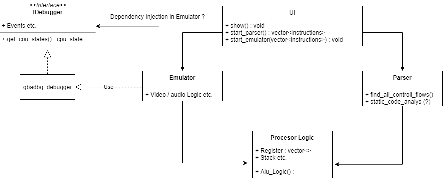

# Ideas for fearures
1. Different libs for emulator parser and CPU stuff 

## Emulator ideas
## Ui ideas
1. Two different files/tabs clear distinction between Thumb and arm
## Parser ideas
1. Control-flow graph
